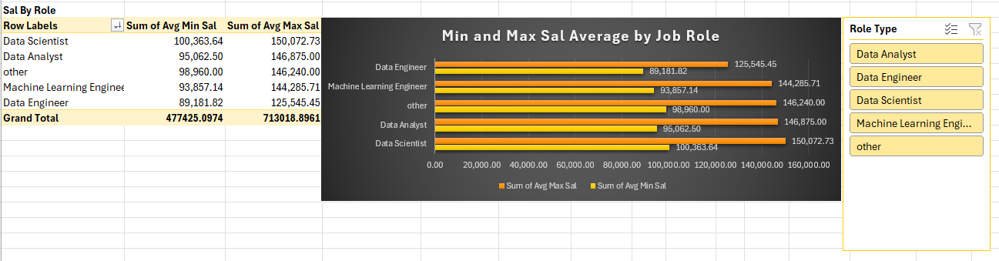
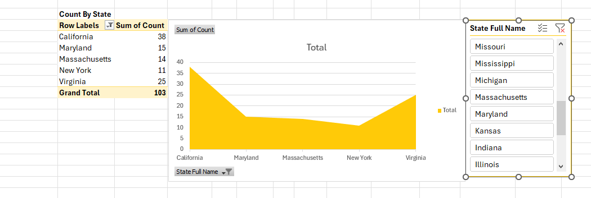
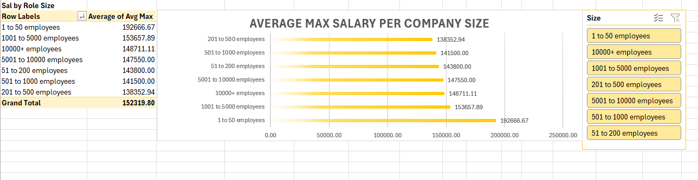
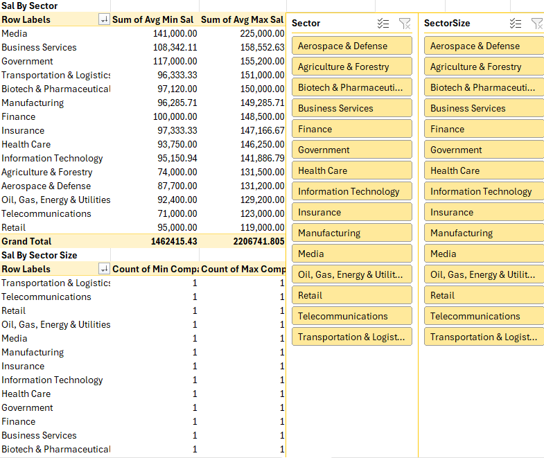
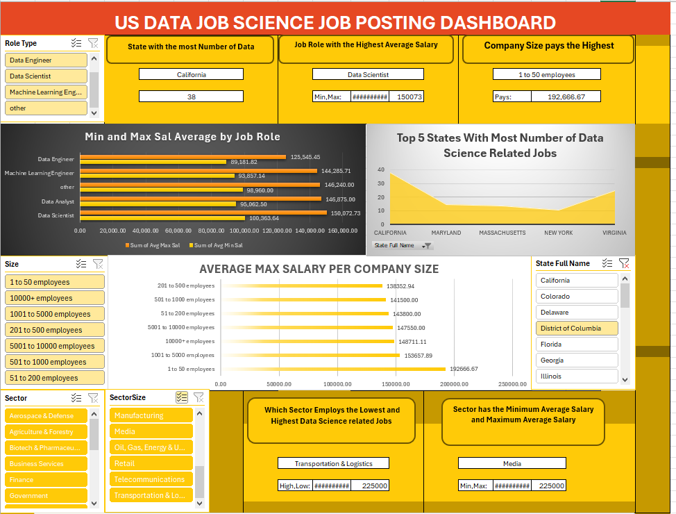
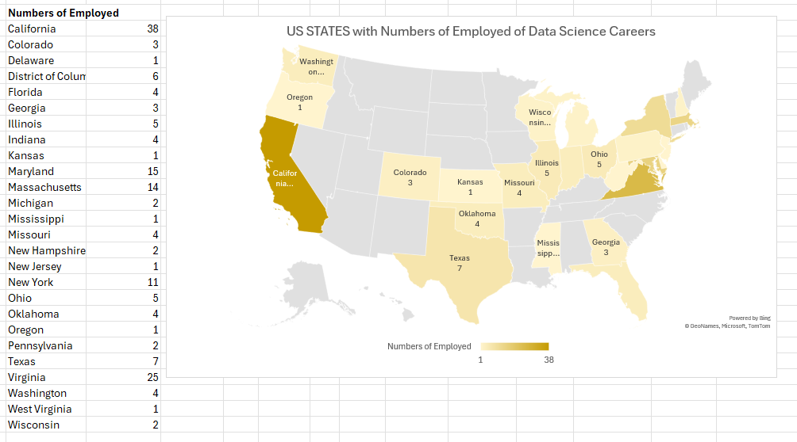
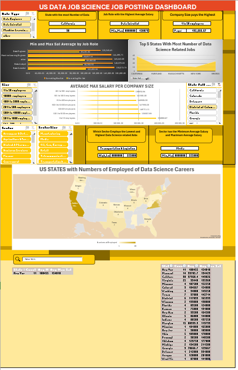

# Midterm Lab Task 3 - Creating PIVOT TABLE and DASHBOARD

This project provides a Data Science Dashboard to analyze job data related to salaries, roles, states, and company sizes. The dashboard includes PivotTables, charts, and interactive slicers for exploring and visualizing the data.

---

## Step 1: Prepare Your Data

Before starting with Pivot Tables and charts, you need to clean and prepare the data.

1. **Clean Your Data**:
   - **Remove duplicates** and handle any missing values in the dataset.
   - Ensure that all columns have the correct data types (e.g., Salary, State, Job Role, etc.).
   
2. **Convert Data into a Table**:
   - Select your data range and convert it into a table. This helps with easier referencing in Pivot Tables.

---

## Step 2: Create Pivot Tables

Pivot Tables are essential for summarizing data and creating the foundation of the dashboard.

### Pivot Table 1: Salary by Job Role
1. Go to **Insert > PivotTable** and select your data range.
2. In the PivotTable Fields pane:
   - Drag Job Role to the **Rows** section.
   - Drag Salary to the **Values** section and set it to show the **average salary**.

### Pivot Table 2: Salary by State
1. Insert another Pivot Table.
2. In the PivotTable Fields pane:
   - Drag State to the **Rows** section.
   - Drag Salary to the **Values** section and set it to show the **average salary**.

### Pivot Table 3: Salary by Company Size
1. Insert another Pivot Table.
2. In the PivotTable Fields pane:
   - Drag Company Size to the **Rows** section.
   - Drag Salary to the **Values** section and set it to show the **average salary**.
   - 

---

## Step 3: Design Your Dashboard

### 1. **State with Most Data Science Jobs**
   - Create a Pivot Table that **counts the number of jobs** by state.
   - Drag Stat to **Rows** and Job Role to **Values** (set to **Count**).

### 2. **Highest Paying Job Role**
   - Use the "Salary by Role" Pivot Table to display the job role with the highest average salary.
   - Apply **conditional formatting** to highlight the highest value.

### 3. **Highest Paying Company Size**
   - From the "Salary by Size" Pivot Table, identify the company size with the highest average salary.
   - Apply **conditional formatting** to highlight the highest value.

### 4. **Sector with Most and Least Data Science Jobs**
   - Create a Pivot Table to **count the number of jobs** by sector.
   - Apply a **bar or column chart** to visualize the sector with the most and least jobs.

### 5. **Sector with Min/Max Average Salary**
   - Create a Pivot Table showing **average salary by sector**.
   - Use **conditional formatting** to highlight the sectors with the **minimum** and **maximum average salary**.

---

## Step 4: Add Slicers for Interactivity

Slicers allow users to filter the data interactively.

### 1. **Insert Slicers**
   - Click any Pivot Table and go to **PivotTable Analyze > Insert Slicer**.
   - Add slicers for:
     - Role Type
     - State
     - Company Size

### 2. **Link Slicers to Pivot Tables**
   - Right-click each slicer and select **Report Connections**.
   - Link each slicer to all Pivot Tables so that they control the entire dashboard's data.

---
**Map and Search Bar Table:**

## Step 5: Finalize Design

### 1. **Add a Map (If Supported)**
   - If you are using **Excel 365 or later**, you can add a **Filled Map** to visualize data by state.
   - Go to **Insert > Map > Filled Map**.

### 2. **Design the Layout**
   - Organize the Pivot Tables, charts, and slicers in a way that is easy to read and visually appealing.
   - Apply a **consistent color scheme** to improve the overall look and readability.
# Screenshot of Pivot Tables and Slicers:

   **Salary Job Role**: 
   
   **Salary By State**: 
   
   **Salary By Company Size:** 
   
   **Salary By Sectors:** 

# Screenshot of  Dashboard:

 
  # Map and Search Bar Table:

 

# Screenshot of Results:
  
  

---

---
